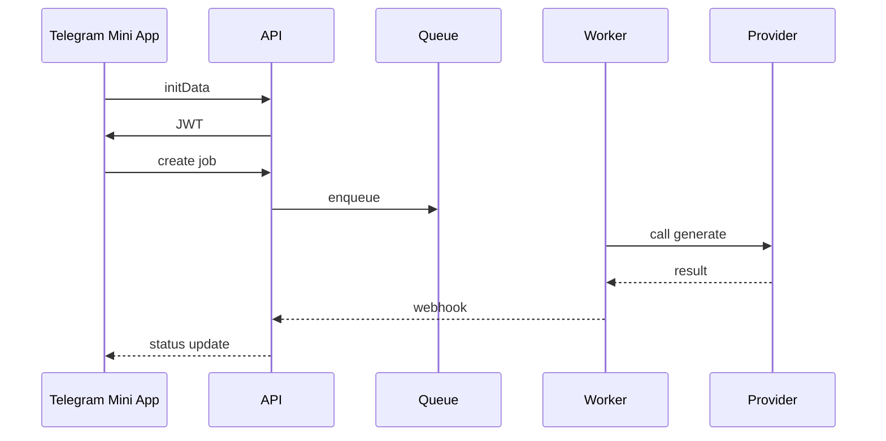
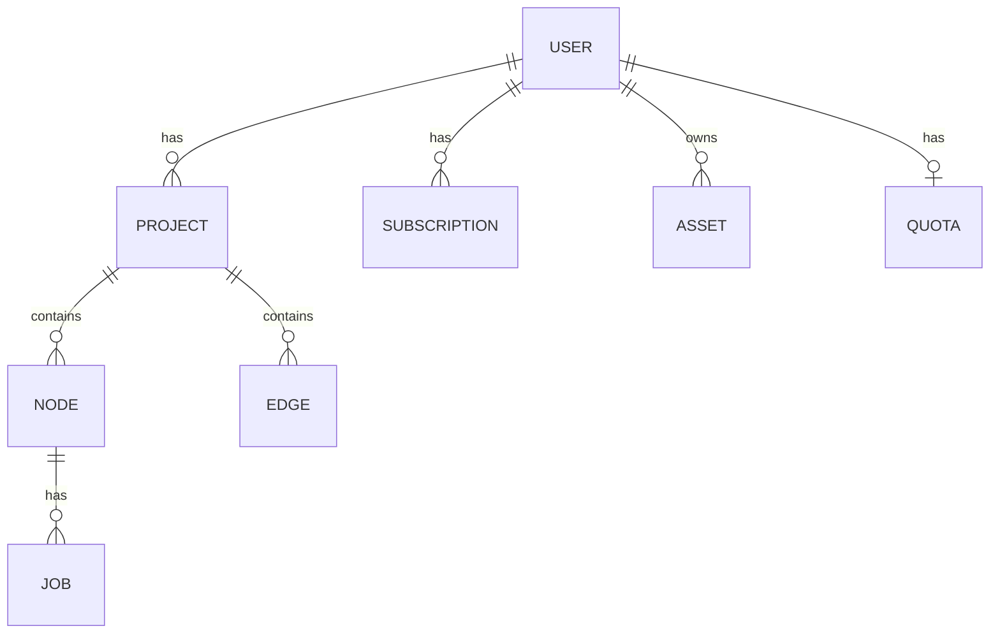
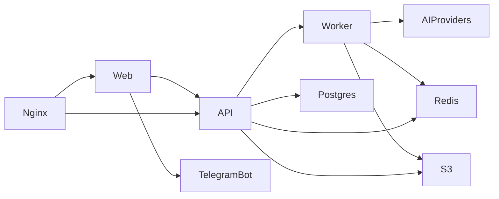
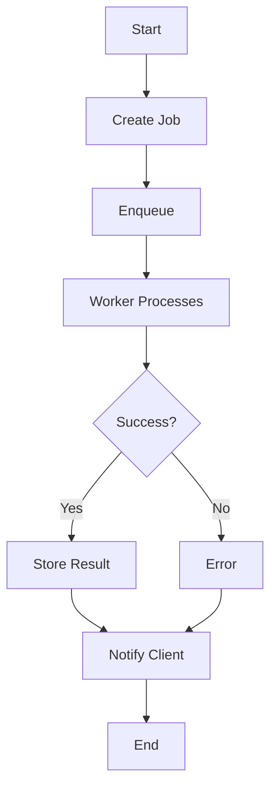

# Diagrams

## Use Case

```mermaid
usecaseDiagram
    actor User
    actor TelegramBot
    actor AIProvider

    User --> (Auth via Telegram)
    User --> (Create Job)
    User --> (Pay Subscription)
    TelegramBot --> (Auth via Telegram)
    TelegramBot --> (Pay Subscription)
    AIProvider --> (Process Job)
```

## Sequence



## ER Diagram



## Component Diagram



## Activity


